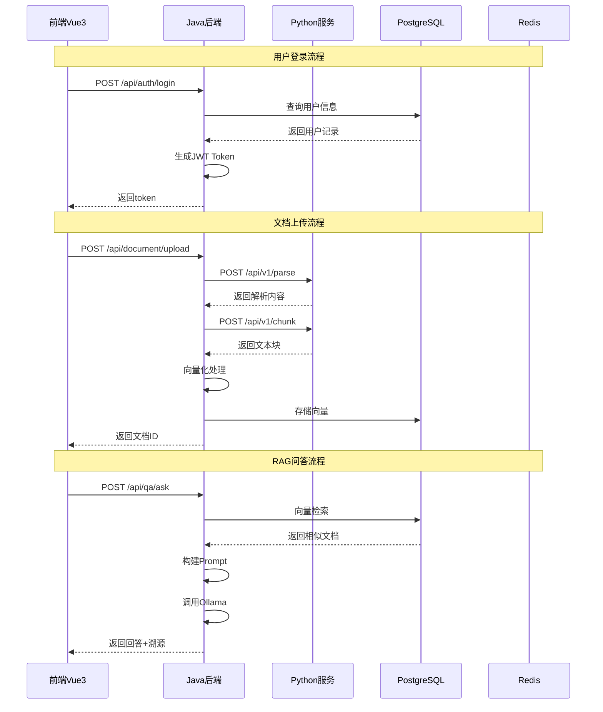

# Prompt整理 - 接口设计说明（前后端对接规范）

## 概述

本文档详细描述FinRag4j项目的接口设计规范，确保前后端工程能够正确对接。

---

## 一、Python预处理服务接口（FastAPI）

### 服务地址
- **Base URL**: `http://python-service:8001`

### 接口清单

#### 1. 文档解析接口

**POST** `/api/v1/parse`

| 参数名 | 类型 | 必填 | 说明 |
|--------|------|------|------|
| file | File | 是 | 上传的文档文件（支持pdf, docx, txt等） |
| file_type | string | 否 | 文件类型标识 |

**响应结构**:
```json
{
  "success": true,
  "data": {
    "content": "解析后的文本内容",
    "metadata": {
      "file_name": "文件名",
      "file_size": 1024,
      "page_count": 10
    }
  },
  "message": "success"
}
```

#### 2. OCR识别接口

**POST** `/api/v1/ocr`

| 参数名 | 类型 | 必填 | 说明 |
|--------|------|------|------|
| image | File | 是 | 图片文件（支持jpg, png, pdf） |
| lang | string | 否 | 语言（zh/en），默认zh |

**响应结构**:
```json
{
  "success": true,
  "data": {
    "text": "识别的文本内容",
    "confidence": 0.95
  },
  "message": "success"
}
```

#### 3. 文本分块接口

**POST** `/api/v1/chunk`

| 参数名 | 类型 | 必填 | 说明 |
|--------|------|------|------|
| text | string | 是 | 需要分块的文本 |
| chunk_size | int | 否 | 块大小，默认512 |
| chunk_overlap | int | 否 | 重叠大小，默认128 |

**响应结构**:
```json
{
  "success": true,
  "data": {
    "chunks": [
      {"content": "第一块内容", "index": 0},
      {"content": "第二块内容", "index": 1}
    ],
    "total_chunks": 10
  },
  "message": "success"
}
```

#### 4. 健康检查接口

**GET** `/health`

**响应结构**:
```json
{
  "status": "healthy",
  "timestamp": "2024-01-01T12:00:00Z"
}
```

---

## 二、Java后端服务接口（Spring Boot）

### 服务地址
- **Base URL**: `http://localhost:8080/api`

### 模块接口清单

#### 1. 认证模块

| 接口 | 方法 | 路径 | 说明 |
|------|------|------|------|
| 登录 | POST | `/auth/login` | 用户登录 |
| 登出 | POST | `/auth/logout` | 用户登出 |
| 获取当前用户 | GET | `/auth/me` | 获取当前登录用户信息 |
| 刷新token | POST | `/auth/refresh` | 刷新访问令牌 |

**登录请求**:
```json
{
  "username": "string",
  "password": "string"
}
```

**登录响应**:
```json
{
  "success": true,
  "data": {
    "access_token": "JWT_TOKEN",
    "refresh_token": "REFRESH_TOKEN",
    "user": {
      "id": 1,
      "username": "admin",
      "name": "管理员",
      "role": "ADMIN",
      "tenant_id": 1
    }
  }
}
```

#### 2. 知识库模块

| 接口 | 方法 | 路径 | 说明 |
|------|------|------|------|
| 列表查询 | GET | `/knowledge/list` | 分页查询知识库列表 |
| 详情查询 | GET | `/knowledge/{id}` | 查询知识库详情 |
| 创建 | POST | `/knowledge` | 创建知识库 |
| 更新 | PUT | `/knowledge/{id}` | 更新知识库 |
| 删除 | DELETE | `/knowledge/{id}` | 删除知识库 |

**创建知识库请求**:
```json
{
  "name": "string (知识库名称)",
  "description": "string (描述)",
  "tags": ["tag1", "tag2"],
  "is_public": false
}
```

#### 3. 文档管理模块

| 接口 | 方法 | 路径 | 说明 |
|------|------|------|------|
| 上传文档 | POST | `/document/upload` | 上传文档到知识库 |
| 文档列表 | GET | `/document/list` | 查询文档列表 |
| 文档详情 | GET | `/document/{id}` | 查询文档详情 |
| 删除文档 | DELETE | `/document/{id}` | 删除文档 |
| 文档预览 | GET | `/document/{id}/preview` | 文档内容预览 |

**上传文档请求**:
```json
{
  "knowledge_id": 1,
  "file": "File",
  "name": "文档名称",
  "description": "文档描述"
}
```

#### 4. RAG问答模块

| 接口 | 方法 | 路径 | 说明 |
|------|------|------|------|
| 发起问答 | POST | `/qa/ask` | 发起问答请求 |
| 对话历史 | GET | `/qa/history` | 获取对话历史 |
| 对话详情 | GET | `/qa/history/{id}` | 获取单条对话详情 |
| 删除对话 | DELETE | `/qa/history/{id}` | 删除对话 |

**问答请求**:
```json
{
  "knowledge_id": 1,
  "question": "用户问题内容",
  "session_id": "可选，会话ID",
  "stream": false
}
```

**问答响应**:
```json
{
  "success": true,
  "data": {
    "answer": "回答内容",
    "sources": [
      {"file_name": "文档1.pdf", "page": 5, "content": "相关原文片段"},
      {"file_name": "文档2.pdf", "page": 10, "content": "相关原文片段"}
    ],
    "similarity_score": 0.85,
    "session_id": "SESSION_ID"
  }
}
```

#### 5. Agent模块

| 接口 | 方法 | 路径 | 说明 |
|------|------|------|------|
| 信贷材料抽取 | POST | `/agent/credit-extract` | 信贷材料抽取 |
| 合规自查 | POST | `/agent/compliance-check` | 合规自查 |
| Agent执行状态 | GET | `/agent/task/{task_id}` | 查询Agent执行状态 |

**信贷抽取请求**:
```json
{
  "knowledge_id": 1,
  "extract_template": "standard",
  "documents": [1, 2, 3],
  "output_format": "excel"
}
```

#### 6. 审计日志模块

| 接口 | 方法 | 路径 | 说明 |
|------|------|------|------|
| 查询日志 | GET | `/audit/logs` | 分页查询审计日志 |
| 导出日志 | GET | `/audit/logs/export` | 导出审计日志 |

---

## 三、前端与后端对接规范

### 1. 请求头规范

| Header | 值 | 说明 |
|--------|-----|------|
| Content-Type | application/json | JSON格式请求 |
| Authorization | Bearer {token} | JWT认证令牌 |
| X-Tenant-Id | {tenant_id} | 租户ID（多租户场景） |

### 2. 统一响应格式

```json
{
  "success": true,
  "code": 200,
  "message": "操作成功",
  "data": {},
  "timestamp": "2024-01-01T12:00:00Z"
}
```

### 3. 错误响应格式

```json
{
  "success": false,
  "code": 400,
  "message": "错误描述",
  "data": null,
  "timestamp": "2024-01-01T12:00:00Z"
}
```

### 4. 错误码定义

| 错误码 | 说明 |
|--------|------|
| 200 | 成功 |
| 400 | 请求参数错误 |
| 401 | 未认证/登录过期 |
| 403 | 无权限 |
| 404 | 资源不存在 |
| 500 | 服务器内部错误 |

---

## 四、前后端对接流程图



---

## 五、接口对接检查清单

### Python服务
- [ ] `/api/v1/parse` 文档解析接口
- [ ] `/api/v1/ocr` OCR识别接口
- [ ] `/api/v1/chunk` 文本分块接口
- [ ] `/health` 健康检查接口

### Java服务
- [ ] 认证模块接口（登录、登出、刷新token）
- [ ] 知识库CRUD接口
- [ ] 文档管理接口（上传、列表、预览、删除）
- [ ] RAG问答接口
- [ ] Agent执行接口
- [ ] 审计日志接口
- [ ] 权限管理接口

### 前端对接
- [ ] axios封装配置
- [ ] 请求拦截器（添加token）
- [ ] 响应拦截器（统一处理错误）
- [ ] API模块封装
- [ ] 登录状态管理

---

## 六、部署环境配置

### 开发环境
- Java服务: `http://localhost:8081`
- Python服务: `http://localhost:8002`
- 前端: `http://localhost:81`

### 测试环境
- Java服务: `http://localhost:8082`
- Python服务: `http://localhost:8003`
- 前端: `http://localhost:82`

### 生产环境
- Java服务: `http://localhost:8080`
- Python服务: 内部网络
- 前端: `http://localhost:80`

---

## 七、安全注意事项

1. **JWT Token安全**:
   - Token有效期设置合理（建议15-30分钟）
   - 使用HTTPS传输
   - 存储在HttpOnly Cookie或内存中

2. **文件上传安全**:
   - 限制文件大小（建议最大50MB）
   - 验证文件类型白名单
   - 文件名过滤，防止路径遍历

3. **SQL注入防护**:
   - 使用MyBatis-Plus参数化查询
   - 禁止拼接SQL

4. **敏感信息保护**:
   - 日志中脱敏处理密码等敏感字段
   - 响应中不返回敏感信息